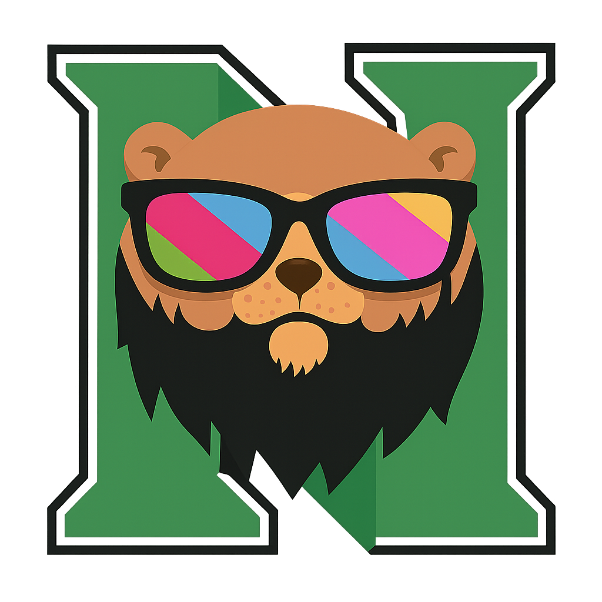
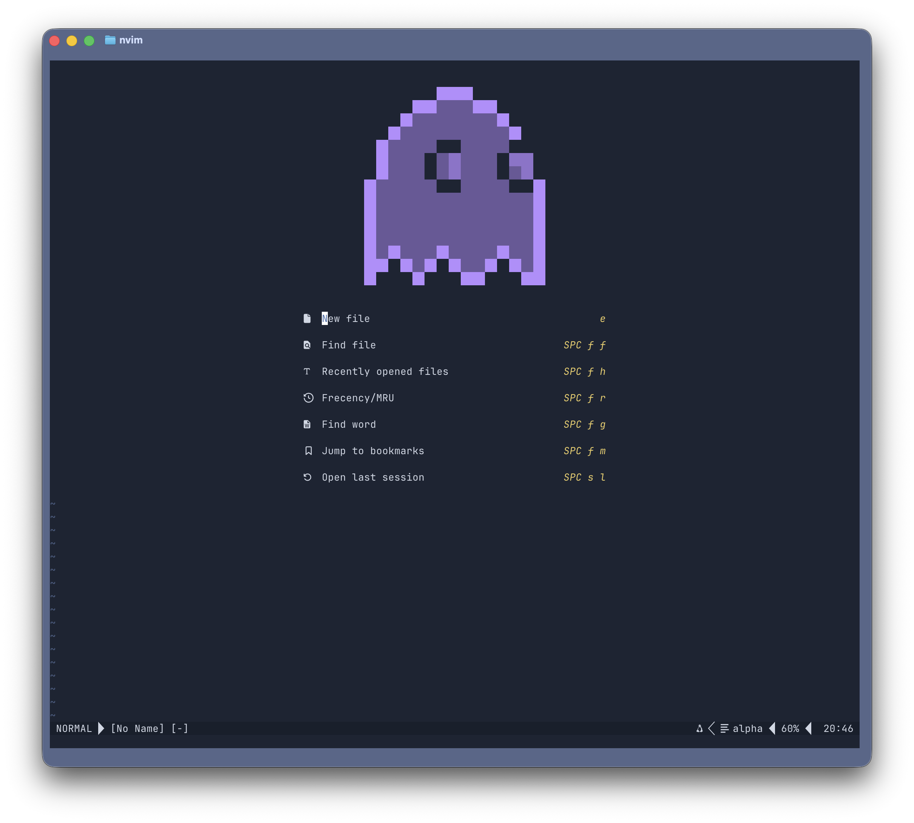
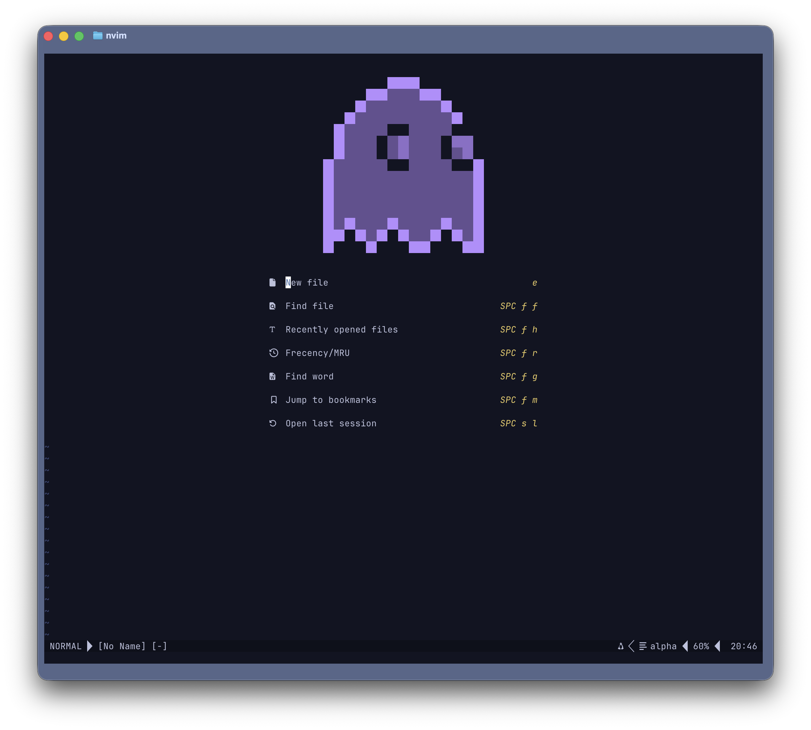
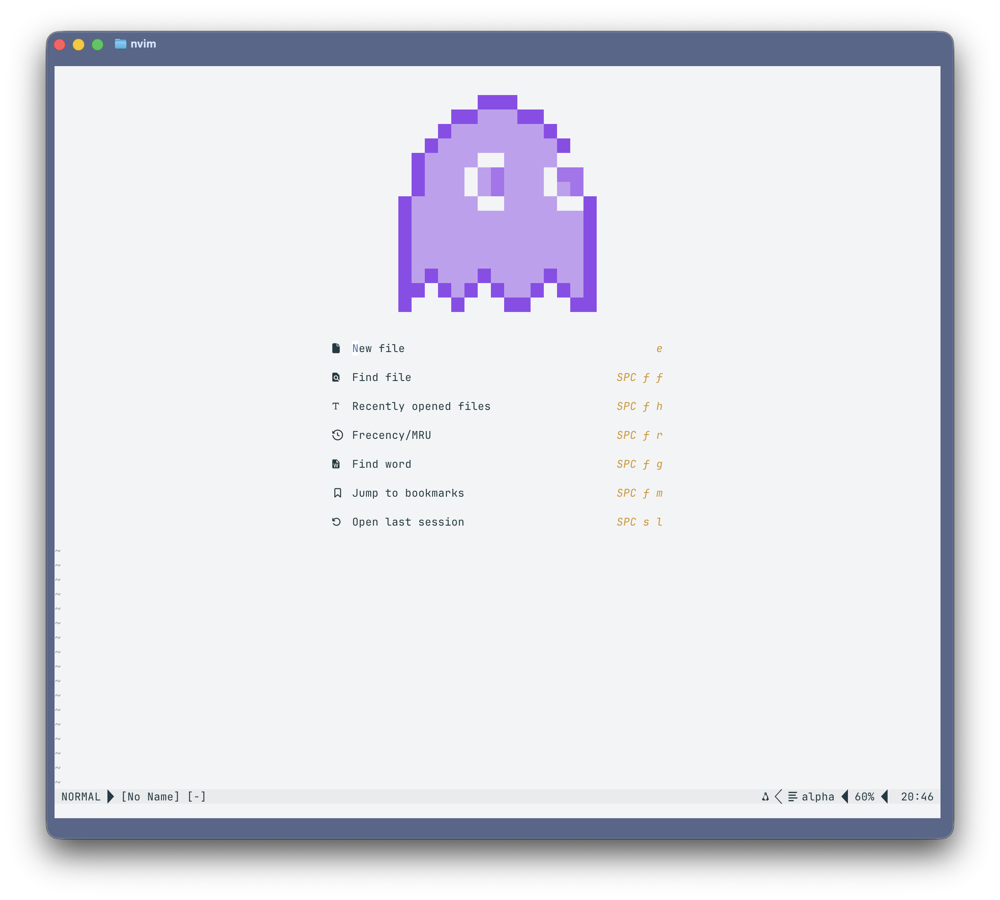
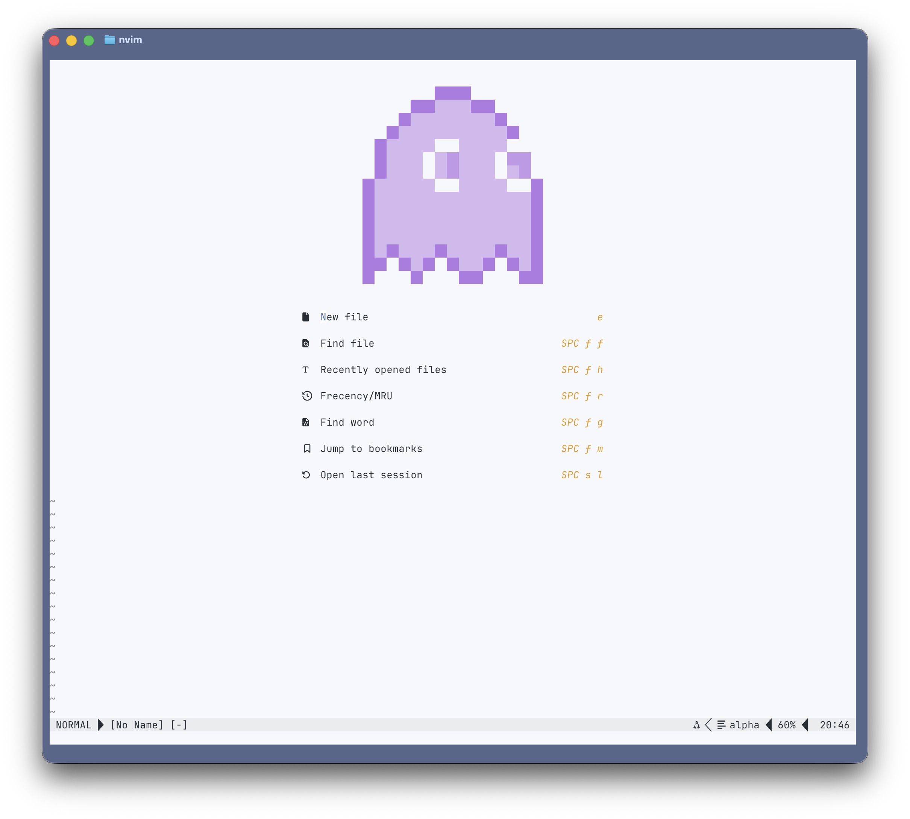
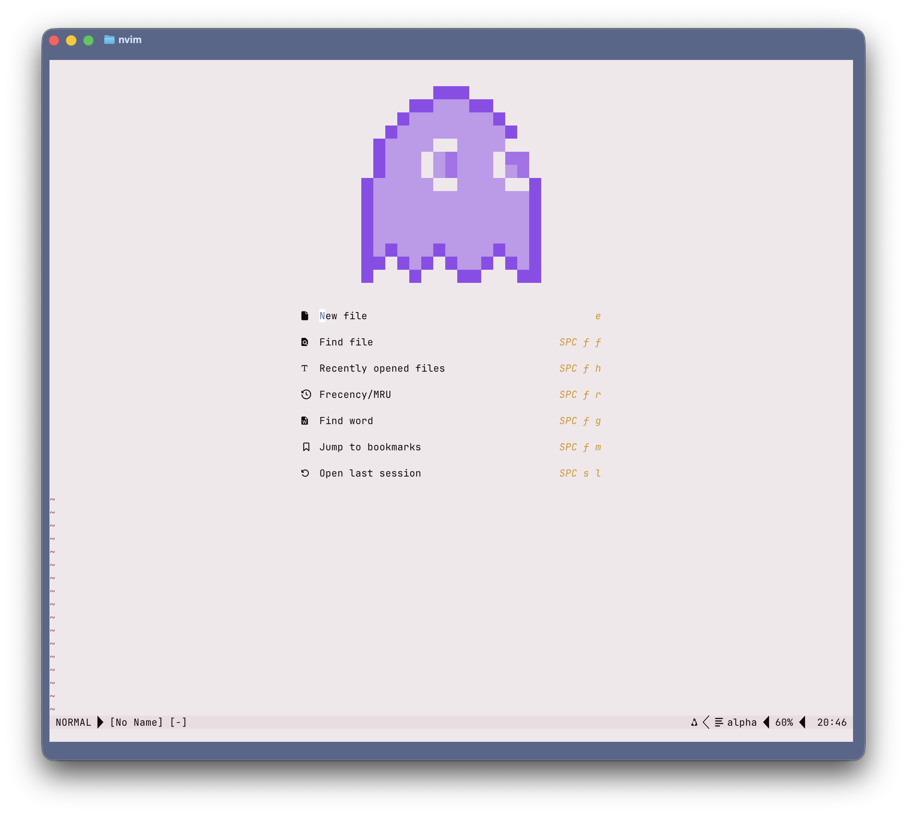
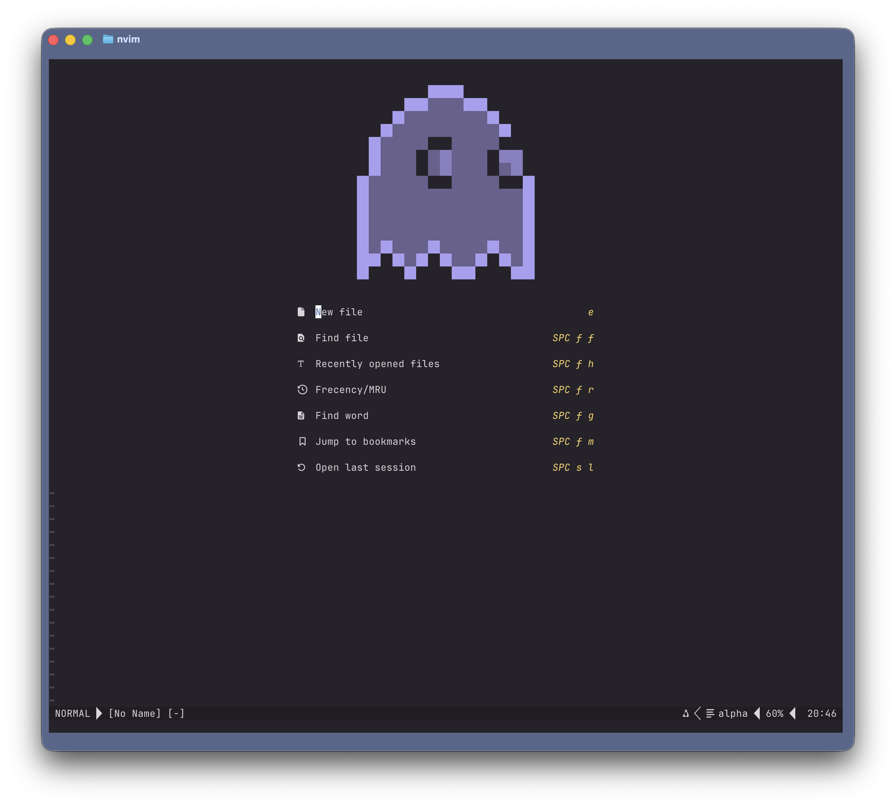
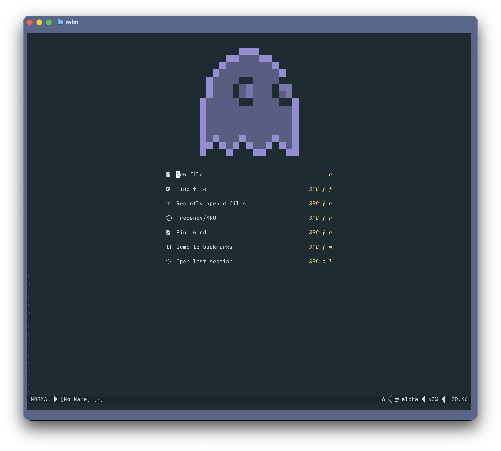
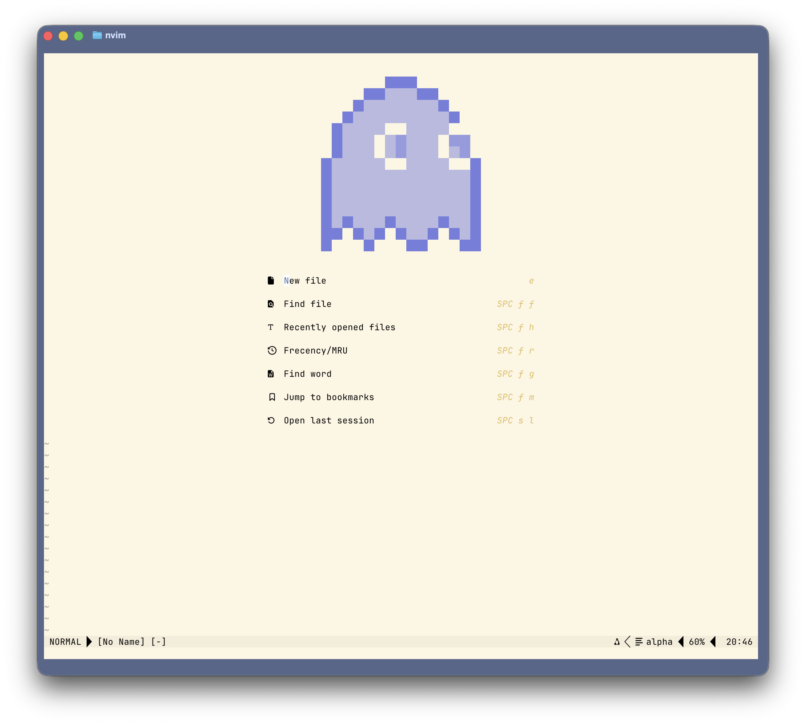

<div align="center">

  
  <h2>Bearded Theme for <a href="https://github.com/neovim/neovim">Neovim</a></h2>
  <p>
    <a href="https://github.com/Ferouk/bearded-nvim/stargazers">
      
    </a>
    <a href="https://github.com/Ferouk/bearded-nvim/issues">
      
    </a>
    <a href="https://github.com/Ferouk/bearded-nvim/graphs/contributors">
      
    </a>
  </p>
  <p>Official port of the Bearded VS Code theme by <a href="https://github.com/BeardedBear">BeardedBear</a>, with 60+ flavors and plugin highlights.</p>
  
</div>

## Features

- 🎨 60+ flavors (dark, light, high contrast) matching the official Bearded VS Code palettes
- 🧭 Core UI coverage: statusline/tabline, splits, floats, diagnostics, diff, cursorline, terminal colors
- 🌲 Syntax/Tree-sitter support plus LSP highlights and inlay hints
- 🔌 Plugin highlights: Telescope, GitSigns, WhichKey, nvim-cmp, Neo-tree, treesitter-context, Noice, notify
- 📊 Statusline helpers: lualine theme/default config and heirline palette helper
- ⚡ Commands for quick switching: `:BeardedReload <slug>` or `:colorscheme bearded-<slug>`

## 🖼️ Preview

<details>
  <summary>🎨 Arc</summary>
  
</details>

<details>
  <summary>🫐 Arc Blueberry</summary>
  
</details>

<details>
  <summary>🌞 Classics Light</summary>
  
</details>

<details>
  <summary>⚡ HC Flurry</summary>
  
</details>

<details>
  <summary>🍓 Milkshake Raspberry</summary>
  
</details>

<details>
  <summary>🪐 Monokai Terra</summary>
  
</details>

<details>
  <summary>🌊 Oceanic</summary>
  
</details>

<details>
  <summary>🌤️ Solarized Light</summary>
  
</details>

## 📦 Install

Lazy.nvim:

```lua
{
  "Ferouk/bearded-nvim",
  name = "bearded",
  priority = 1000,
  build = function()
    -- Generate helptags so :h bearded-theme works
    local doc = vim.fs.joinpath(vim.fn.stdpath("data"), "lazy", "bearded", "doc")
    pcall(vim.cmd, "helptags " .. doc)
  end,
  config = function()
    require("bearded").setup({
      flavor = "arc", -- any flavor slug
    })
    vim.cmd.colorscheme("bearded")
  end,
}
```

Packer:

```lua
use({
  "Ferouk/bearded-nvim",
  run = ":helptags ALL", -- make :h bearded-theme available
  config = function()
    require("bearded").setup({ flavor = "arc" })
    vim.cmd.colorscheme("bearded")
  end,
})
```

## 🧑‍💻 Usage

```lua
require("bearded").setup({
  flavor = "arc",          -- see flavor list below
  transparent = false,
  bold = true,
  italic = true,
  dim_inactive = false,
  terminal_colors = true,
  on_highlights = function(set, palette, opts)
    -- optional override
    set("Normal", { fg = palette.ui.default })
  end,
})
vim.cmd.colorscheme("bearded")
```

Switch flavors on the fly:

- `:BeardedReload <slug>` (no generated files required)
- `:colorscheme bearded-<slug>` (uses prebuilt colorscheme stubs)

## 🌈 Flavors (slug)

| Family          | Slugs |
| --------------- | ----- |
| Arc             | <ul><li>arc</li><li>arc-blueberry</li><li>arc-eggplant</li><li>arc-eolstorm</li><li>arc-reversed</li></ul> |
| Aquarelle       | <ul><li>aquarelle-cymbidium</li><li>aquarelle-hydrangea</li><li>aquarelle-lilac</li></ul> |
| Exotic          | <ul><li>altica</li><li>earth</li><li>coffee</li><li>coffee-cream</li><li>coffee-reversed</li><li>void</li></ul> |
| Black           | <ul><li>black-&-amethyst(-soft)</li><li>black-&-diamond(-soft)</li><li>black-&-emerald(-soft)</li><li>black-&-gold(-soft)</li><li>black-&-ruby(-soft)</li></ul> |
| Classics        | <ul><li>classics-anthracite</li><li>classics-light</li></ul> |
| Feat            | <ul><li>feat-will</li><li>feat-webdevcody</li><li>feat-gold-d-raynh(-light)</li><li>feat-mellejulie(-light)</li></ul> |
| High Contrast   | <ul><li>hc-ebony</li><li>hc-midnightvoid</li><li>hc-flurry</li><li>hc-wonderland-wood</li><li>hc-brewing-storm</li><li>hc-minuit</li><li>hc-chocolate-espresso</li></ul> |
| Milkshake       | <ul><li>milkshake-vanilla</li><li>milkshake-mint</li><li>milkshake-raspberry</li><li>milkshake-mango</li><li>milkshake-blueberry</li></ul> |
| Monokai         | <ul><li>monokai-terra</li><li>monokai-metallian</li><li>monokai-stone</li><li>monokai-black</li><li>monokai-reversed</li></ul> |
| Solarized/Ocean | <ul><li>oceanic</li><li>oceanic-reversed</li><li>solarized-dark</li><li>solarized-light</li><li>solarized-reversed</li></ul> |
| Stained         | <ul><li>stained-blue</li><li>stained-purple</li></ul> |
| Surprising      | <ul><li>surprising-eggplant</li><li>surprising-blueberry</li><li>surprising-watermelon</li></ul> |
| Other           | <ul><li>themanopia</li><li>vivid-purple</li><li>vivid-black</li><li>vivid-light</li></ul> |

## 🔌 Plugin highlights

- Telescope, GitSigns, WhichKey, nvim-cmp
- Neo-tree, treesitter-context
- Noice, notify
- Lualine helpers (theme + default config) and heirline palette helper

### 📊 Statusline examples

Lualine:

```lua
local bearded = require("bearded")
bearded.setup({ flavor = "arc" })

require("lualine").setup({
  options = {
    theme = require("bearded.plugins.lualine").theme(bearded.palette()),
  },
})
```

Default lualine config:

```lua
local bearded = require("bearded")
bearded.setup({ flavor = "arc" })
require("bearded.plugins.lualine_default").setup(bearded.palette())
```

Heirline palette helper:

```lua
local bearded = require("bearded")
local colors = require("bearded.plugins.heirline").colors(bearded.palette())
-- use colors.bg/fg/accent in your components
```

## ❓ Help

- `:h bearded-theme`
- Commands: `:BeardedReload <slug>`, `:colorscheme bearded`, `:colorscheme bearded-<slug>`

## 🙏 Credits

- Theme design & official VS Code extension by [BeardedBear](https://github.com/BeardedBear/bearded-theme)

## 🤝 Contributing

See `CONTRIBUTING.md` for regeneration steps, formatting, and checks. CI runs stylua + smoke on push/PR.

## 📝 License

GPL-3.0-only. See `LICENSE`.
